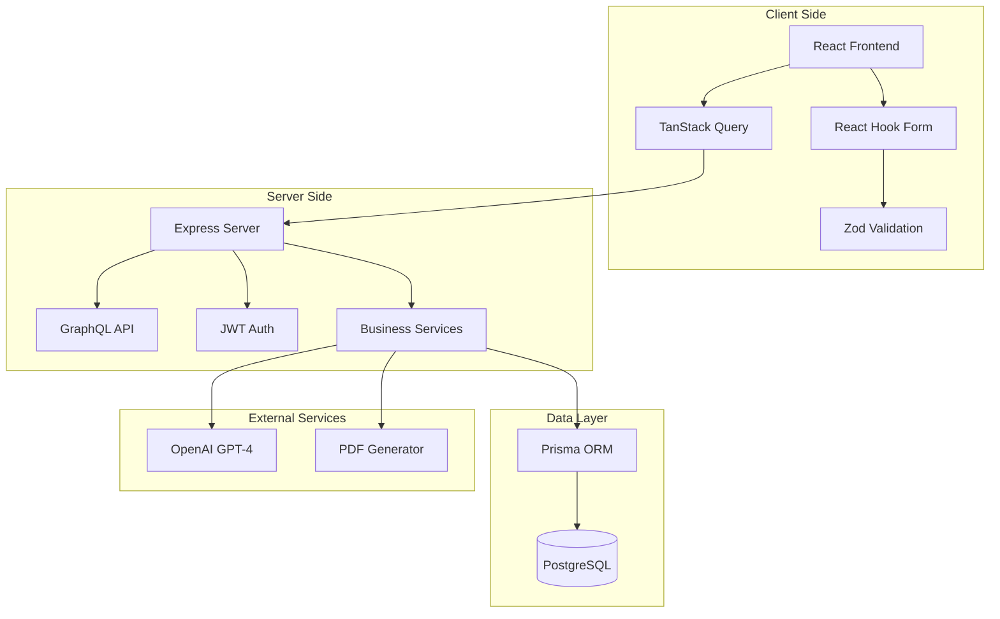
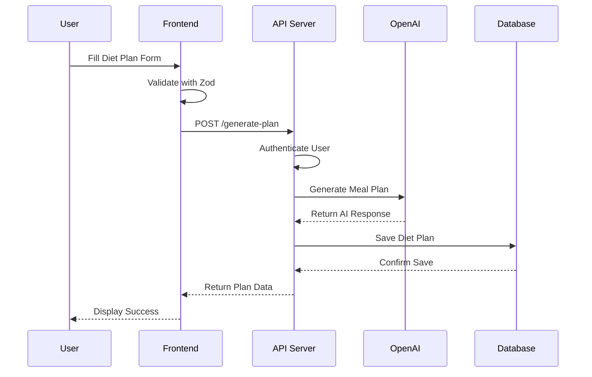
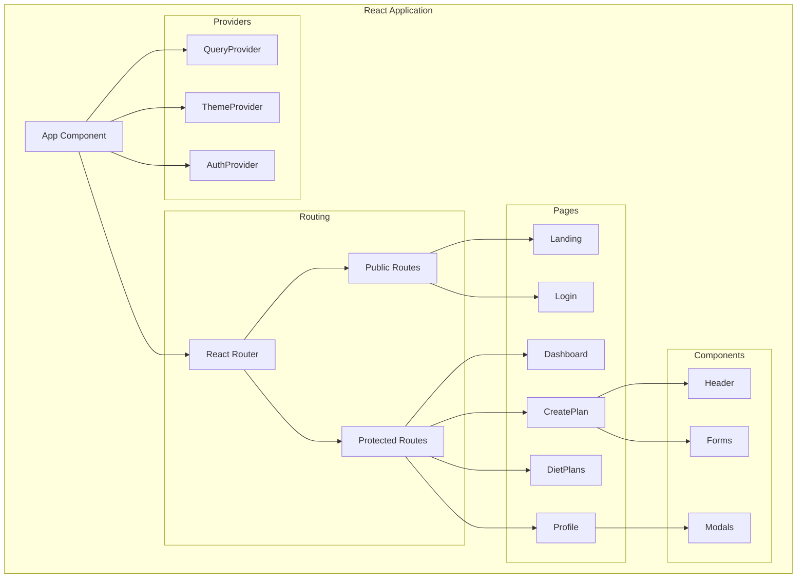
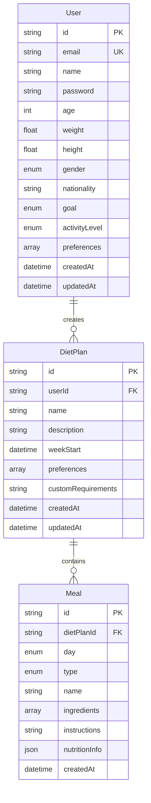
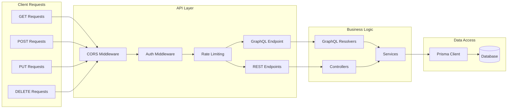
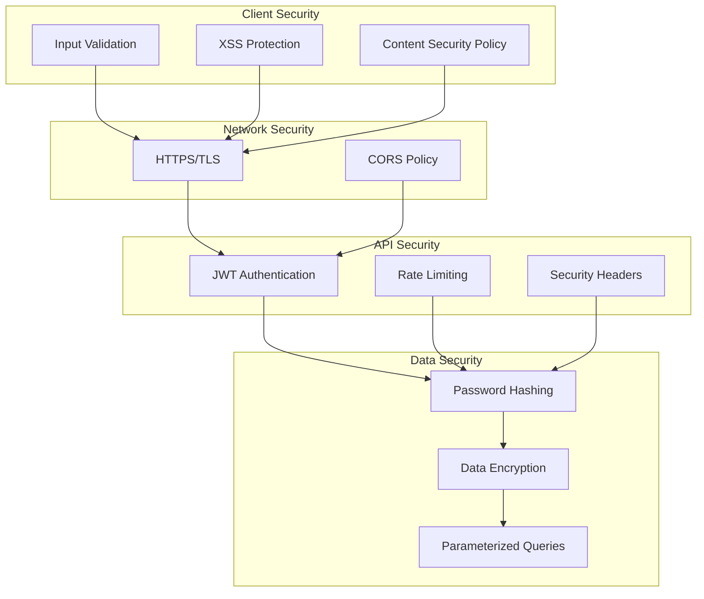
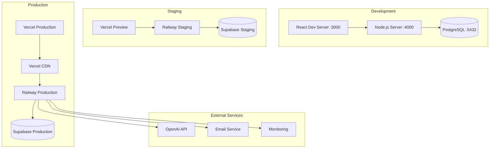
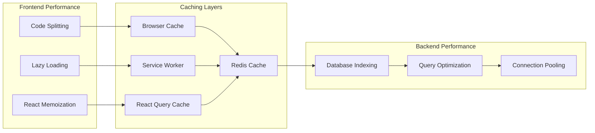
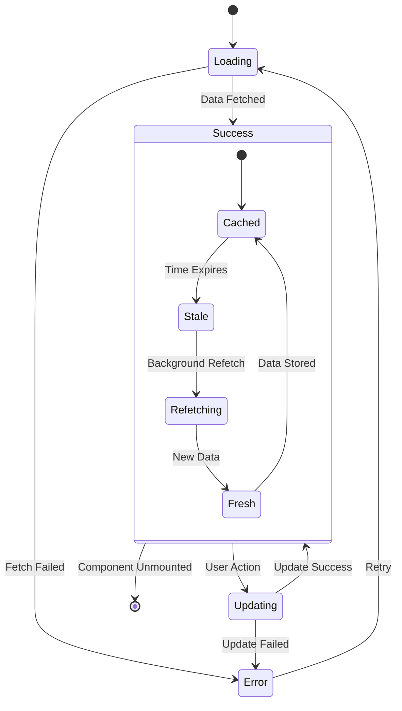

# 🎨 Diet Planner Visual Architecture

## 📊 High-Level System Architecture

## 🔄 Data Flow Architecture

## 🏗️ Component Architecture

## 🗄️ Database Schema

## 🌐 API Architecture

## 🔐 Security Architecture

## 🚀 Deployment Architecture

## 📊 Performance Architecture

## 🔄 State Management Flow

This visual architecture provides a comprehensive overview of your modern diet planner application structure! 🎨✨